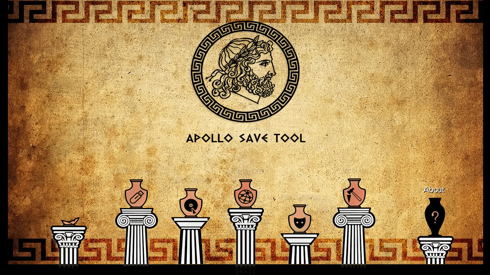
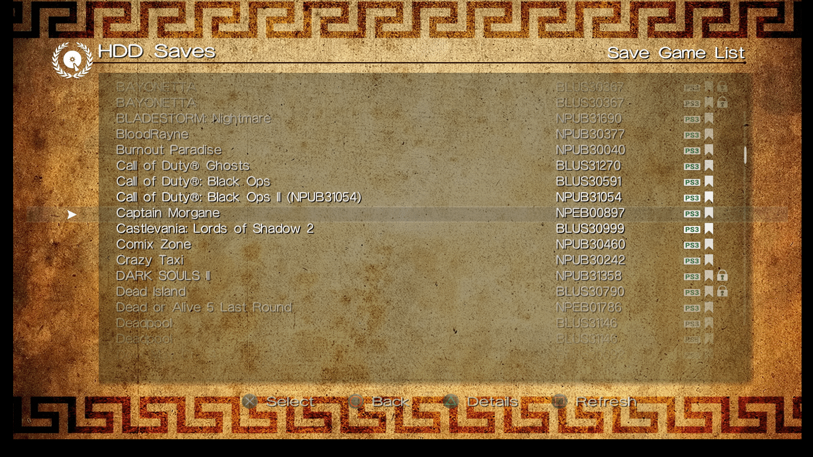
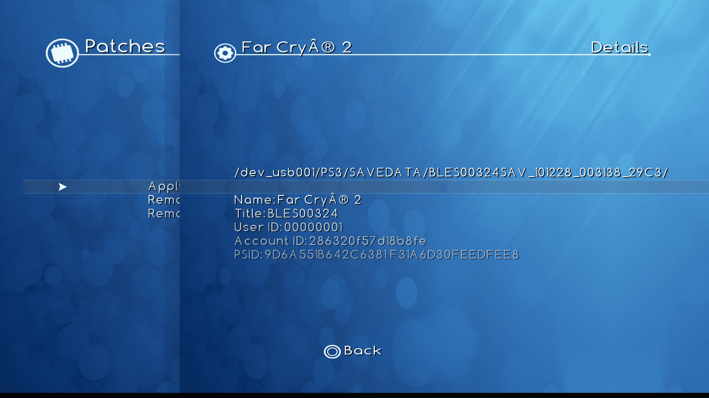
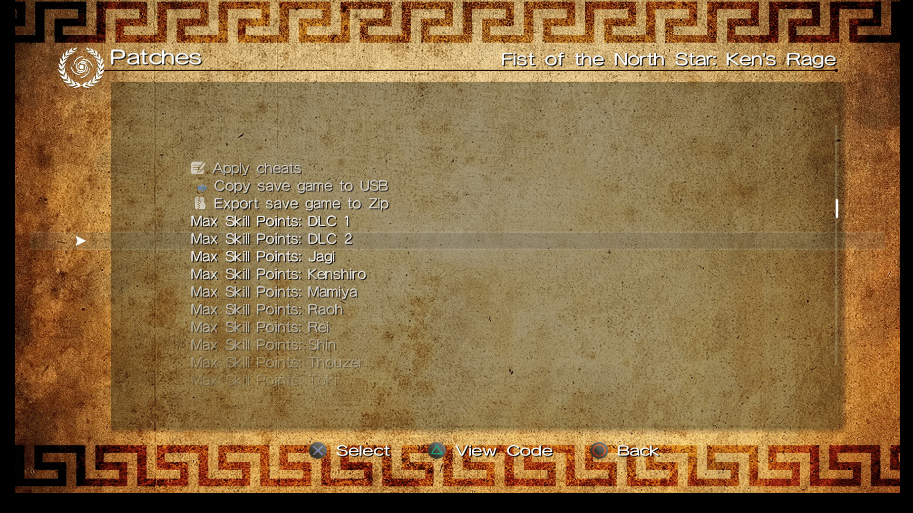
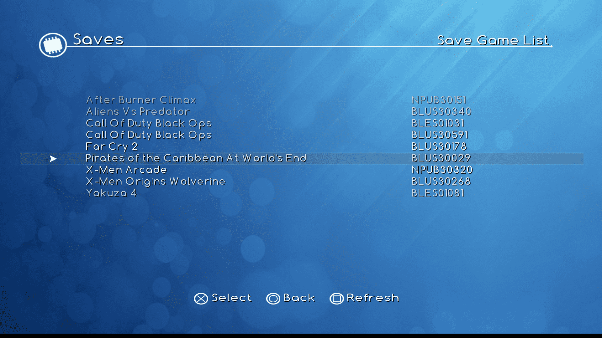
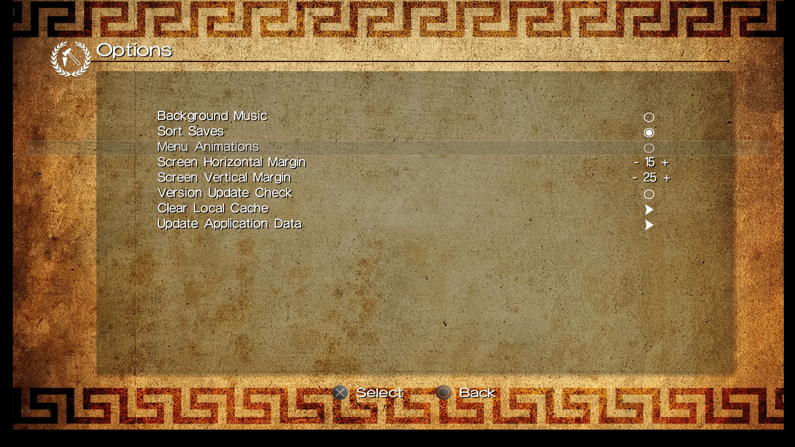
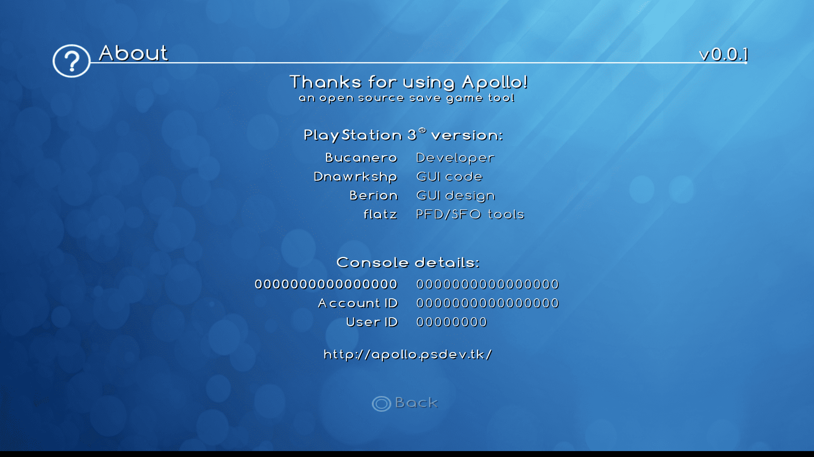

# Apollo Save Tool (PS3)

[![Downloads][img_downloads]][app_downloads] [![Release][img_latest]][app_latest] [![License][img_license]][app_license]

**Apollo Save Tool** is an application to manage save-game files on the PlayStation 3.

The `apollo-ps3` homebrew app allows to download, unlock, patch and resign save-game files directly on your PS3.

**Comments, ideas, suggestions?** You can contact [me](https://github.com/bucanero/) on [Twitter](https://twitter.com/dparrino) and on [my website](http://www.bucanero.com.ar/).

# Features

* **Easy to use:** no crypto-key configuration or advanced setup needed.
* **Standalone:** no computer required, everything happens on the PS3.
* **Save files listing:** quick access to all the save files on USB and the internal PS3 HDD (+ file details)
* **Save SFO unlocking:** allows the user to remove the copy-lock flag, enabling transfer of `Copying Prohibited` save files.
* **Save files patching:** supports [Bruteforce Save Data](https://bruteforcesavedata.forumms.net/) and Game Genie cheat patches to enhance your savegames.
* **Save PFD resigning:** allows the user to resign save files made by other users and consoles.
* **Save downloading:** easy access to an Online Database of save-game files to download straight to your PlayStation.
* **Automatic settings:** auto-detection of PSID and Account-ID settings.

# Download

Get the [latest version here][app_latest].

### Changelog

See the [latest changes here](https://github.com/bucanero/apollo-ps3/blob/master/CHANGELOG.md).

# Setup instructions

No special setup is needed. Just download the latest `apollo-ps3.pkg` package and install it on your PlayStation 3.
On first run, the application will detect and setup the required user settings.

# Usage

Using the application is simple and straight-forward: 

 - Move **UP/DOWN** to select the save-game file you want to patch, and press . The patch screen will show the available fixes for the file. Select the patches and click `Apply`.
 - To see the item's details, press .
It will open the context menu on the screen. Press  to return to the list.
 - To reload the list, press .
 - Press left **(L1/L2)** or right trigger buttons **(R1/R2)** to move pages up or down.

## Notes

- **USB saves:** your files must be placed on `/dev_usb000/PS3/SAVEDATA/` or `/dev_usb001/PS3/SAVEDATA/`.
- **HDD saves:** files will be scanned from `/dev_hdd0/home/000000XX/savedata/`, where `XX` is the current `User ID`.

# Online Database

The application also provides direct access to the [Apollo online database](https://github.com/bucanero/apollo-saves) of save-game files for PlayStation 3 games. These usually offer additional features such as completed games that can save you many hours of playing.

Currently, the list of available games and files is limited, but the project aims to add more save-games shared by the community.

**Note:** Downloaded save files **must be resigned** using Apollo before loading them in your games.

# Screenshots

# FAQs

 1. Where I can get a save-game for *XYZ game*?
    
    You can check sites like [Brewology.com](https://ps3.brewology.com/gamesaves/savedgames.php?page=savedgames&system=ps3), and [GameFAQs](https://gamefaqs.gamespot.com/ps3/). Also, searching on [Google](http://www.google.com) might help.
 1. I have a save-game file that I want to share. How can I upload it?
    
    If you have a save file that is not currently available on the Online Database and want to share it, please check [this link](https://github.com/bucanero/apollo-saves) for instructions.
 1. Why is it called **Apollo**?
    
    [Apollo](https://en.wikipedia.org/wiki/Apollo) was the twin brother of [Artemis](https://en.wikipedia.org/wiki/Artemis), goddess of the hunt. Since this project was born using the [Artemis-GUI](https://github.com/Dnawrkshp/ArtemisPS3/Artemis-GUI) codebase, I decided to respect that heritage by calling it Apollo.

# Credits

* [Bucanero](http://www.bucanero.com.ar/): Project developer
* [Dnawrkshp](https://github.com/Dnawrkshp/): [Artemis PS3](https://github.com/Dnawrkshp/ArtemisPS3)
* [Berion](https://www.psx-place.com/members/berion.1431/): GUI design
* [flatz](https://twitter.com/flat_z): [SFO/PFD tools](https://github.com/bucanero/pfd_sfo_tools/)
* [aldostools](https://aldostools.org/): [Bruteforce Save Data](https://bruteforcesavedata.forumms.net/)
* [aluigi](http://aluigi.org): [offzip](http://aluigi.altervista.org/mytoolz.htm) and [packzip](http://aluigi.altervista.org/mytoolz.htm)

# Building

You need to have installed:

- [PS3 toolchain](https://github.com/bucanero/ps3toolchain)
- [PSL1GHT](https://github.com/bucanero/PSL1GHT) library
- [Tiny3D](https://github.com/Estwald/PSDK3v2/tree/master/libraries-src/Tiny3D) library (from Estwald)
- [polarSSL](https://github.com/ps3dev/ps3libraries/blob/master/scripts/015-polarssl.sh) library
- [dbglogger lib](https://github.com/bucanero/psl1ght-libs/tree/master/dbglogger) (my own debug logging library)

Run `make` to create a release build. After that, run `make pkg` to create a `.pkg` install file. 

You can also set the `PS3LOAD` environment variable to the PS3 IP address: `export PS3LOAD=tcp:x.x.x.x`.
This will allow you to use `make run` and send `apollo-ps3.self` directly to the PS3Load listener.

To enable debug logging, build Apollo Save Tool with `make DEBUGLOG=1`. The application will send debug messages to
UDP multicast address `239.255.0.100:30000`. To receive them you can use [socat][] on your computer:

    $ socat udp4-recv:30000,ip-add-membership=239.255.0.100:0.0.0.0 -

# License

`apollo-ps3` is released under the [MIT License](LICENSE).

[PSDLE]: https://repod.github.io/psdle/
[socat]: http://www.dest-unreach.org/socat/
[app_downloads]: https://github.com/bucanero/apollo-ps3/releases
[app_latest]: https://github.com/bucanero/apollo-ps3/releases/latest
[app_license]: https://github.com/bucanero/apollo-ps3/blob/master/LICENSE
[img_downloads]: https://img.shields.io/github/downloads/bucanero/apollo-ps3/total.svg?maxAge=3600
[img_latest]: https://img.shields.io/github/release/bucanero/apollo-ps3.svg?maxAge=3600
[img_license]: https://img.shields.io/github/license/bucanero/apollo-ps3.svg?maxAge=2592000
